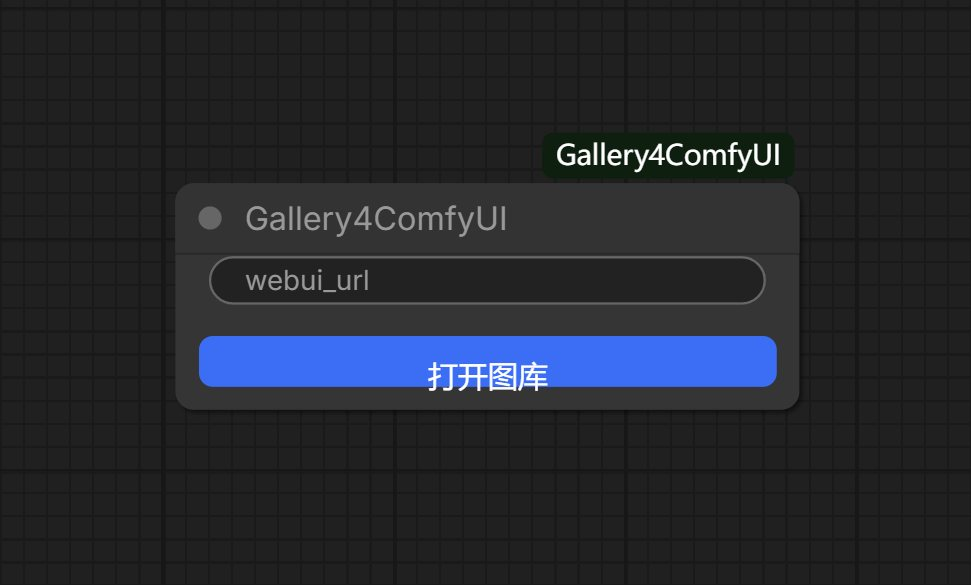
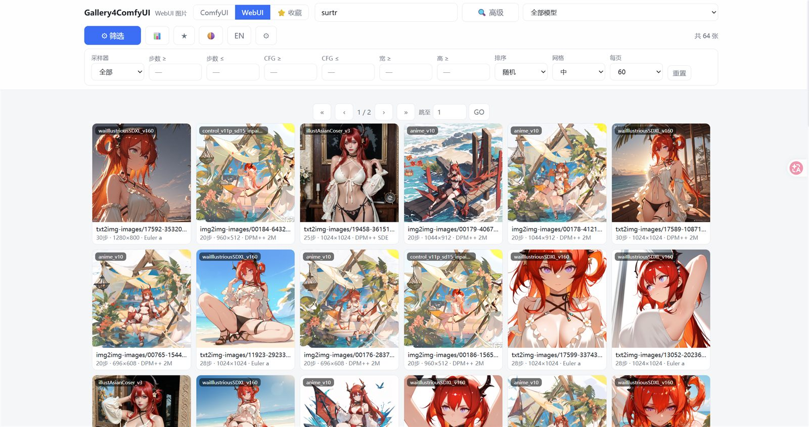
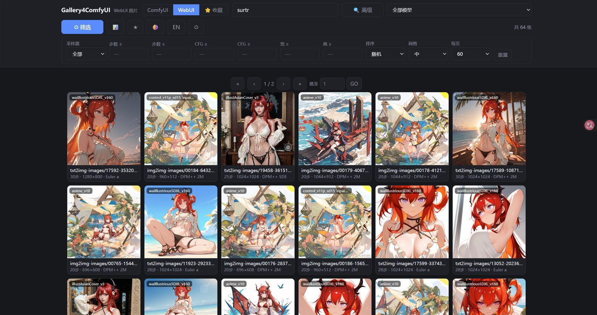
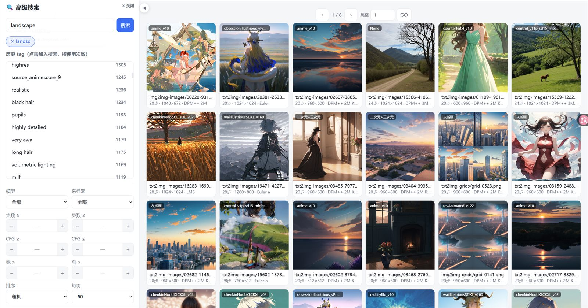
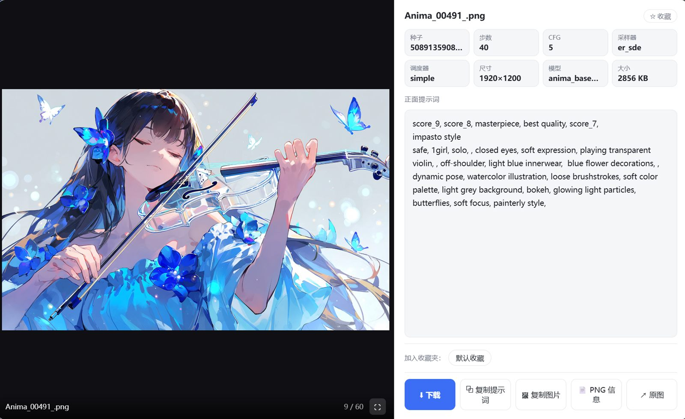
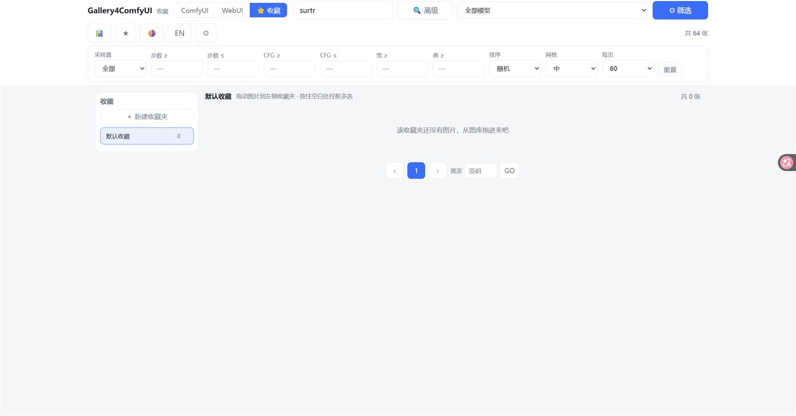

# 🖼️ Gallery4ComfyUI

**双来源图片图库** —— 浏览、搜索、筛选 ComfyUI 与 Stable Diffusion WebUI 生成的图片，支持高级 tag 搜索、多收藏夹与全屏浏览。

**A dual-source image gallery for ComfyUI** — browse, search and filter images generated by ComfyUI and Stable Diffusion WebUI, with advanced tag search, multi-folder favorites and a fullscreen viewer.

<p>
  
  
  
  
</p>

---

## 🖼️ 界面预览 / Interface

### 从节点打开 / Open from the Node

在 ComfyUI 画布中添加节点 **Gallery4ComfyUI**（分类 Gallery），点击节点上的「**打开图库**」按钮即可进入图库 —— 就这么简单。

Add the **Gallery4ComfyUI** node (category: Gallery) in the ComfyUI canvas and click the「**打开图库**」button on the node — that's all it takes.



### 主界面 / Main Interface

打开图库后的主界面：顶部为来源标签页（ComfyUI / WebUI / ⭐收藏）、搜索框与快捷按钮，中间为图片网格，网格上下都有翻页条。

The main gallery view: source tabs (ComfyUI / WebUI / ⭐Favorites), search box and quick buttons on top; the image grid in the center with pagination bars on both top and bottom.



### 深色主题 / Dark Theme

一键切换浅色 / 深色主题，颜色随主题自动适配。

Switch between light and dark themes with one click — all colors adapt automatically.



### 高级搜索 / Advanced Search

高级搜索侧栏：上方是历史 tag 统计（按使用次数排序，点击即加入搜索），带键盘补全的搜索框，下方继承普通搜索的全部筛选；右侧为搜索结果，可折叠侧栏。

The advanced search sidebar: history tag statistics (sorted by usage, click to add to search) with keyboard-autocomplete search box, all normal filters inherited below; search results on the right, collapsible panel.



### 点开图片 / Lightbox

点击图片打开灯箱：左侧大图（底部文件名与页码），右侧参数徽章（种子 / 步数 / CFG / 采样器 / 尺寸 / 模型）、提示词面板、收藏夹与操作按钮；⛶ 按钮进入全屏浏览，滚轮翻图。

Click an image to open the lightbox: large preview on the left (filename & page counter at bottom), parameter badges (seed / steps / CFG / sampler / size / model), prompt panel, favorites and action buttons on the right; the ⛶ button enters fullscreen mode with mouse-wheel navigation.



### 收藏界面 / Favorites

收藏页：左侧收藏夹列表（可新建 / 删除 / 重命名），右侧为当前收藏夹的图片；支持拖拽入夹与拉框多选批量操作。

The favorites page: folder list on the left (create / delete / rename), images of the current folder on the right; drag-and-drop into folders and drag-select for batch operations.



---

## ✨ 功能详解 / Features

### 🗂️ 双来源 / Dual Source

图库同时支持两个图片来源，标签页互斥切换：**ComfyUI**（输出目录）与 **SD WebUI**（outputs 目录），另有独立的 **⭐收藏** 页。SD WebUI 来源为可选功能，首次运行可跳过配置。

The gallery supports two image sources with mutually-exclusive tabs: **ComfyUI** (output directory) and **SD WebUI** (outputs directory), plus a dedicated **⭐Favorites** page. The SD WebUI source is optional — you can skip the setup on first run.

### ⚡ 懒启动 / Lazy Start

ComfyUI 启动时插件零开销：不扫描、不占资源。点击节点「打开图库」按钮才触发索引构建，顶部显示实时进度条；索引为增量缓存，第二次打开秒开，只重新处理新增或修改的文件。

Zero overhead when ComfyUI boots — no scanning, no resource usage. Indexing starts only when you open the gallery (via the node button), with a live progress bar on top. The index is cached incrementally: reopening is instant, only new or modified files are re-parsed.

### 🔍 搜索与筛选 / Search & Filter

支持按文件名 / 正面提示词 / 负面提示词搜索；可按**模型**（数百种）、采样器、步数、CFG、尺寸组合筛选；排序支持最新 / 最旧 / 随机 / 文件名；经典分页在网格上下都有，每页数量可选（30 / 60 / 120 / 240）。

Search by filename / positive prompt / negative prompt; filter by **model** (hundreds), sampler, steps, CFG and size; sort by newest / oldest / random / name; classic pagination on both top and bottom of the grid, with selectable page size (30 / 60 / 120 / 240).

### 🧠 高级搜索 / Advanced Search

高级搜索侧栏提供**历史 tag 统计**：从你的历史图片中提取全部 tag 并按使用次数从高到低排列，每个 tag 标注使用次数；点击即加入搜索框（逗号分隔，支持多 tag AND 组合）。搜索框带**键盘补全**：输入时弹出候选，↑↓ 选择、Tab / Enter 确认。侧栏可折叠，结果区向左平滑延伸，动画过渡。

The advanced search sidebar provides **history tag statistics**: every tag is extracted from your historical images and ranked by usage count (each shows its count); click to add it to the search box (comma-separated, multi-tag AND combination). The search box has **keyboard autocomplete**: candidates pop up as you type, ↑↓ to select, Tab / Enter to confirm. The sidebar collapses with a smooth animation, letting the result area extend leftward.

### ⭐ 收藏 / Favorites

支持创建**多个收藏夹**，图片可**拖拽**进任意收藏夹；在网格空白处**拉框多选**后可批量拖入 / 移出收藏夹；灯箱内一键加入收藏（按钮变金色 + 提示）。普通搜索中的 ★ 星标会收藏到「默认收藏」。

Create **multiple folders**; drag images into any folder; **drag-select** on the grid for batch drag-in / remove; one-click favorite in the lightbox (button turns gold with a toast). The ★ star in normal search saves to "Default favorites".

### 🖥️ 灯箱与全屏 / Lightbox & Fullscreen

点击图片打开灯箱：左侧大图，右侧**参数徽章**（种子 / 步数 / CFG / 采样器 / 调度器 / 尺寸 / 模型 / 大小）、提示词面板（自动填满空间不留白）、PNG 原始信息、收藏夹选择与操作按钮（下载为主按钮）。**⛶ 全屏观看**：隐藏信息区纯图全屏，**滚轮**或左右按钮切换图片，Esc 退出。

Click an image to open the lightbox: large preview on the left; **parameter badges** (seed / steps / CFG / sampler / scheduler / size / model / filesize), prompt panel (fills remaining space, no blank gaps), raw PNG info, folder picker and action buttons (download as primary) on the right. **⛶ Fullscreen**: pure-image fullscreen mode, flip images with the **mouse wheel** or the side buttons, Esc to exit.

### 🌐 体验细节 / UX

支持**中 / EN 双语**切换（记忆选择）、浅色 / 深色主题、自定义滚动条、SD WebUI 根目录**目录选择器**（盘符 → 目录树浏览，标注含 outputs 的目录）、搜索框旁「🔍 高级」快捷入口。

**中 / EN language** switch (remembered), light / dark themes, custom scrollbars, a **directory picker** for the SD WebUI root (drives → folder tree with "has outputs" badges), and a one-click "🔍 Advanced" shortcut next to the search box.

---

## 📦 安装 / Installation

```
1. 下载最新 Release 的 zip
2. 解压出 "Gallery4ComfyUI" 文件夹，放入  ComfyUI/custom_nodes/
3. 重启 ComfyUI
4. 画布添加节点 "Gallery4ComfyUI"（分类 Gallery）→ 点击「打开图库」
   —— 或直接访问:  http://127.0.0.1:8188/gallery4comfyui/
```

1. Download the latest release zip.
2. Extract the `Gallery4ComfyUI` folder into `ComfyUI/custom_nodes/`.
3. Restart ComfyUI.
4. Add node `Gallery4ComfyUI` (category `Gallery`) → click「打开图库」— or open `http://127.0.0.1:8188/gallery4comfyui/` directly.

### 🚀 首次运行 / First Run

首次打开会弹窗引导配置 **SD WebUI 根目录**（含 outputs 的目录）——**可跳过**，跳过也能正常使用 ComfyUI 图库，之后随时可在 ⚙ 中配置。索引在首次打开时后台构建（顶部进度条可见），之后增量缓存秒开。

On first open a dialog asks for your **SD WebUI root folder** (the one containing `outputs`) — **optional**, skip it and the ComfyUI gallery works fine; configure anytime via the ⚙ button. The index builds in the background on first open (progress bar on top); afterwards it loads from cache instantly and only re-scans changed files.

---

## 🗂️ 数据存储 / Data Storage

所有运行时数据都在插件目录内，**不修改 ComfyUI 任何原有文件**：

All runtime data lives inside the plugin folder — **nothing touches your ComfyUI files**:

```
custom_nodes/Gallery4ComfyUI/userdata/
├── index/comfyui_index.json   # ComfyUI 图片索引（提示词/参数/模型）
├── index/webui_index.json     # SD WebUI 图片索引
├── settings.json              # SD WebUI 根目录路径
└── folders.json               # 你的收藏夹
```

删除插件目录即可完全卸载（索引会在下次使用时重建）。

Delete the plugin folder to fully uninstall (indexes rebuild on next use).

## 🧩 兼容性 / Compatibility

- ComfyUI 0.3x+
- Chrome / Edge / Firefox（全屏模式需要 Fullscreen API）
- SD WebUI 来源为可选
- 零第三方依赖（仅使用 ComfyUI 内置 aiohttp / folder_paths）

## ❓ FAQ

**Q: 为什么第一次打开很慢？**
A: 首次索引构建需要几分钟（数万张图），顶部有进度条；之后增量缓存秒开。

**Q: Why is the first open slow?**
A: The first index build takes a few minutes (tens of thousands of images) with a visible progress bar; afterwards the incremental cache makes it instant.

**Q: 没有 SD WebUI 能用吗？**
A: 能。跳过配置即可，仅使用 ComfyUI 图片来源。

**Q: Can I use it without SD WebUI?**
A: Yes. Skip the setup — the ComfyUI source works on its own.

**Q: 索引会占用 ComfyUI 空间吗？**
A: 不会，索引存在插件自己的 userdata/ 目录，删除插件即完全清理。

**Q: Does the index take up ComfyUI space?**
A: No — it lives in the plugin's own `userdata/`; deleting the plugin removes everything.

## 📜 免责声明 / Disclaimer

- - 用户对自己浏览的内容负责；本图库仅浏览你本机已有的文件。

- - Users are responsible for their own content. This gallery merely browses files already present on your machine.

## ⭐ Support

如果这个项目对你有帮助，请点个 **Star** 支持一下！遇到问题或建议，欢迎提交 [Issue](https://github.com/ainghhh/Gallery-for-ComfyUI/issues)。

If this project helps you, please give it a **Star**! For bugs or suggestions, feel free to open an [Issue](https://github.com/ainghhh/Gallery-for-ComfyUI/issues).

## ⚖️ License

[MIT](./LICENSE)
